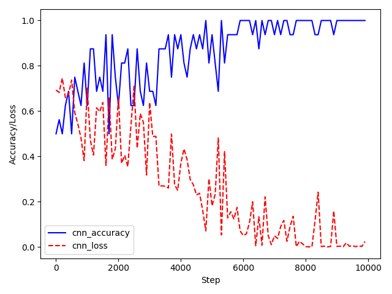
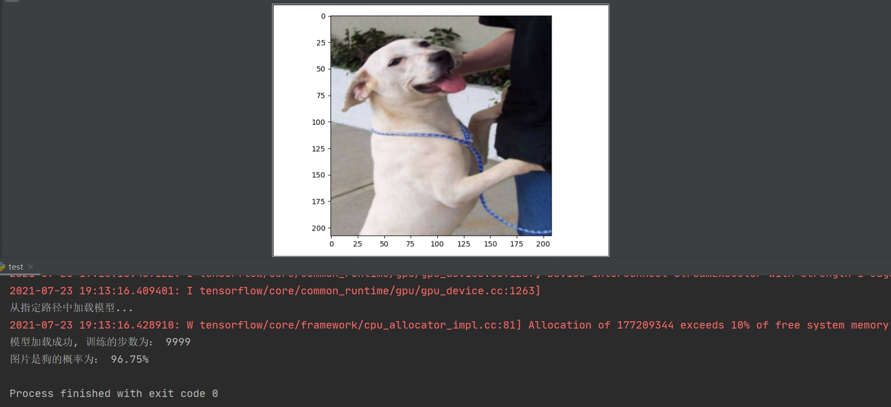

## 文件说明
* data(文件夹)：包含 test 测试集和 train 训练集
* log(文件夹)：保存训练模型和参数
* image(文件夹): 存放训练图和预测结果图  
* input_data.py：负责实现读取数据，生成批次（batch）
* model.py：负责实现我们的神经网络模型
* training.py：负责实现模型的训练以及评估 【1.先跑这个来训练好模型，再跑test.py】
* test.py： 从测试集中随机抽取一张图片, 进行预测是猫还是狗  【2.跑完training.py后，再跑这个来测试图片进行预测猫或狗】

## 注意点
* training.py 和 test.py 读取文件的路径需要修改成符合自己当前的文件夹路径
* 导包问题（本项目代码接口用的是tensorflow1版本的, 若装的tensorflow是2版本的, 则按如下导包即可）
```python
# import tensorflow as tf
import tensorflow.compat.v1 as tf
tf.disable_v2_behavior()
```

## 训练图（准确率与损失值）
  

## 预测结果图

